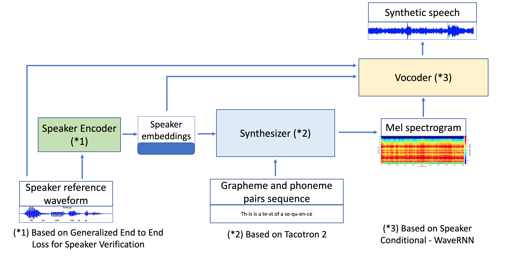
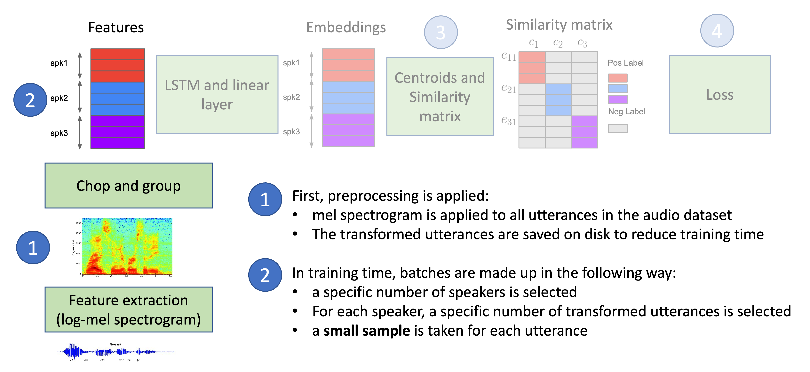
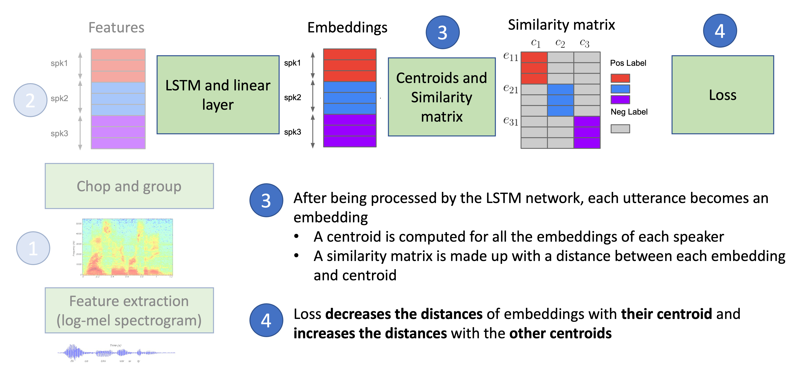
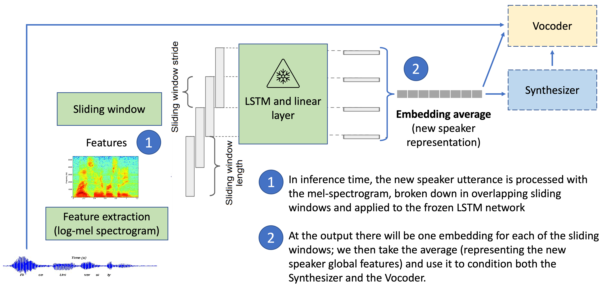
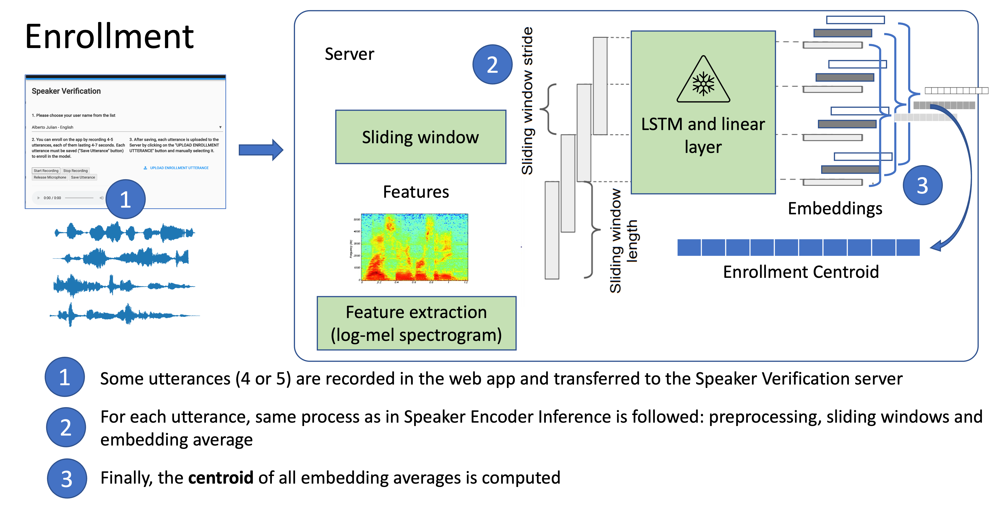
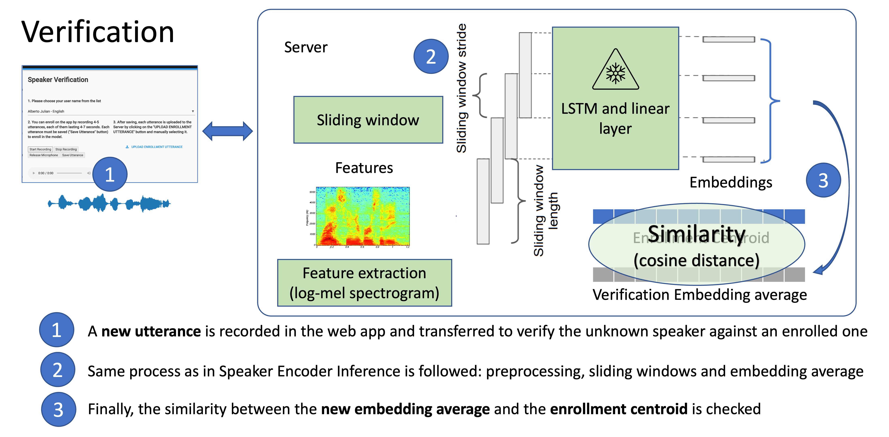
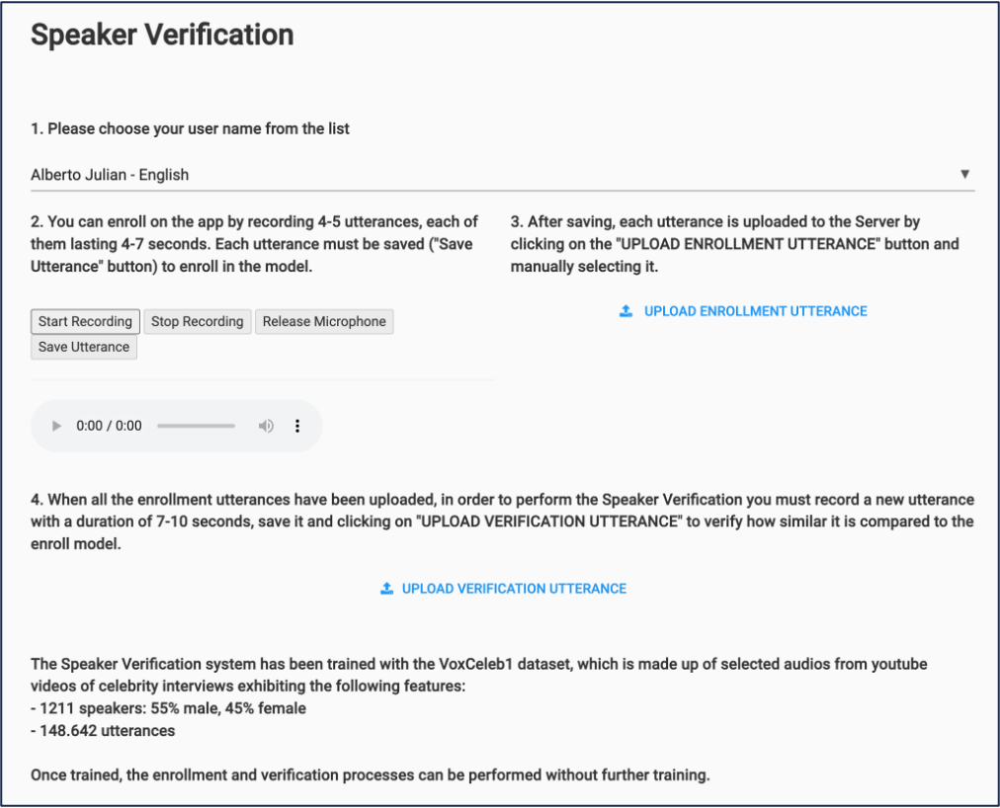
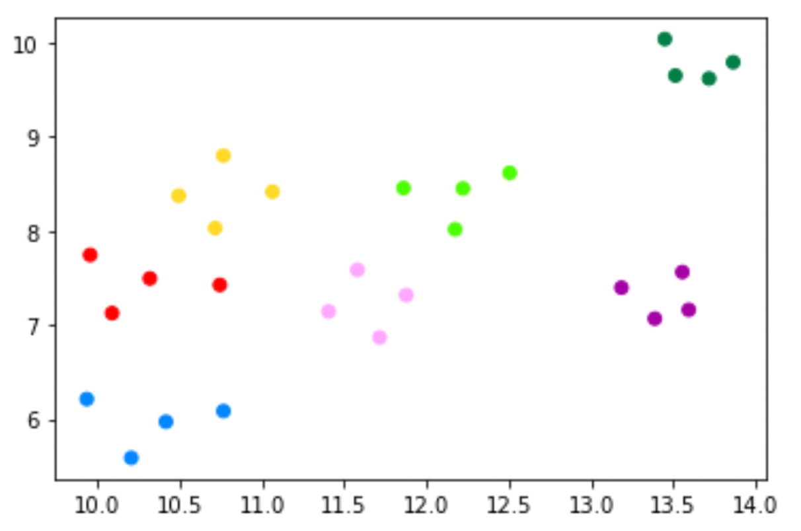

# Speaker Verification
This project was initially intended as part of a zero-shot multi-speaker Text-To-Speech, as described in the paper [Transfer Learning from Speaker Verification to Multispeaker Text-To-Speech Synthesis](https://arxiv.org/abs/1806.04558) and shown in next figure:

Finally, only the Speaker Encoder part was implemented, which is Google's Speaker Verification for Android that supports enrollment based on "OK Google" repetition, and described in Android Speaker Verification paper: [Generalised End to End (GE2E) loss for Speaker Verification](https://arxiv.org/abs/1710.10467) with modifications in the first mentioned paper. However, in order to have significant embeddings, this implementation is not limited to verify "OK Google", and the speaker can emit any sentence with a duration of 5-10 seconds.

[Here is a Video of presentation and demo](https://www.youtube.com/watch?v=sSPnZogKkd8)

A main point of this system is being able to verify a speaker without having to re-train the system. This is achieved thanks to the following features:
- the system trained with a big number of speakers creates a **speaker embedding space**
- an enrollment process (described later) defines the embeddings for a new speaker 

The "Transfer Learning" system leverages on the **speaker embedding space** to characterize a new speaker
The embedding of the new speaker is used to condition the Synthesizer, so that the mel-spectrograms at the end are modified with the new speaker's features

There is a SpeakerEncoder.yaml configuration file with the parameters of the different stages, which is loaded as a python dictionary.

## Dataset loading

The implementation described in the paper used several datasets: VoxCeleb1, VoxCeleb2 and a Google internal dataset.

This version of the Speaker Encoder has been trained just with the dataset VoxCeleb1, which must be downloaded from:

http://www.robots.ox.ac.uk/%7Evgg/data/voxceleb/vox1.html

In SpeakerEncoder.yaml, the parameter "rel_path" must be set to the root of the "wav" folder where the VoxCeleb1 dataset is installed.

## Preprocessing and feature extraction
During the **preprocessing** step, the wav files from the dataset are preprocessed:
* long silences are trimmed using Voice Activity Detection
* normalization is applied
* mel spectrograms are extracted from the preprocessed wav files with a predefined number of bands or channels "mel_n_channels", and the result are mel spectrogram frames

During the **feature extraction** step, the preprocessed mel spectrogram frames for each speaker are sampled in order to fetch batches, with three levels of randomness:
* a predefined number of speakers "speakers_per_batch" is randomly selected
* for each selected speaker, a predefined number of utterances "utterances_per_speaker" is randomly selected
* for each selected utterance, a partial part is randomly extracted; the partial duration in number of frames is given by the "partials_n_frame" parameter

Next figure shows the **preprocessing** and **feature extraction** steps:

The output of the feature extraction mode is a dictionary for each speaker with all the mel spectrogram frames resulting of preprocessing all the wav files from that speaker. This dictionary is saved as a pickle file.

Feature extraction is performed by executing feature_extraction.py

## Training
During the **training** step, the model is trained with batches obtained after the **feature extraction** step:
* three LSTM layers process the batches
* a linear layer at the end gives speaker embeddings as the output
* centroids and similarity matrix for the speakers in the batch are computed
* the loss is computed

Next figure shows the **training** step:

The Speaker Encoder was trained along 500.000 steps during 11 hours in Google Colab Pro.

Training mode is started from train.py.

## Comments about the training
- There are no epochs because there is not a repeating dataset: at each step, the speakers and utterances are randomly sampled.
- The system is self-supervised: at each batch, the labels are the speaker order in that specific batch

## Inference
In inference mode the following steps are followed:
* a short audio is recorded from a speaker, potentially not trained in the model
* the audio is preprocessed with the feature extraction steps
* a batch is made by applying a sliding window to the resulting mel spectrogram frames
* the batch is presented to the trained model to get the output embeddings
* the output embeddings are averaged, thus resulting a unique embedding for the speaker

Inference mode is entered by executing:
- test.py
- Speaker_Verification.ipynb

### Speaker enrollment
Next figure describes the speaker enrollment process:

### Speaker verification
Next figure describes the speaker verification process:

There is also a simple client based on the platform anvil which can communicate with the anvil server in `anvil_server.py` to support the enrollment and verification steps:

## Results

Next figure shows a UMAP 2D projection of seven speaker enrollments, each with four utterances.

